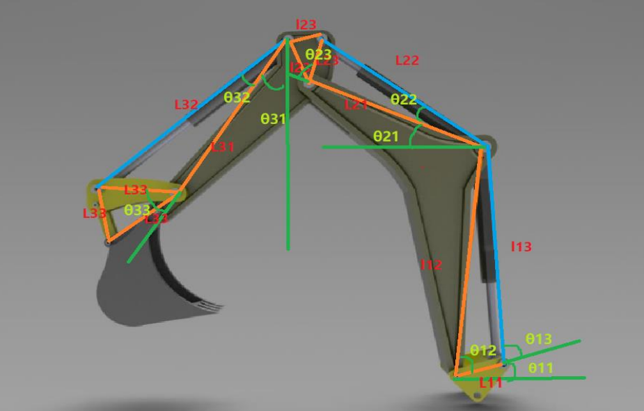

Backhoe Mechanism modelling and simulation project
=================

Table of contents
=================

<!--ts-->
* [Home](#Backhoe-Mechanism-modelling-and-simulation-project)
* [Introduction](#Introduction)
* [Assumptions and Specifications](#Assumptions-and-Specifications)
* [Modeling](#Modeling)
* [A priori Analysis](#A-priori-Analysis)
* [Numerical solution](#Numerical-solution)
* [Analysis](#Analysis)
* [Result](#Result)
<!--te-->

Introduction
=================

The main goal of this project is to create a model for the mechanical linkage system of the
backhoe of a Caterpillar backhoe loader. The Backhoe mechanism contains many components
such as pumps, and motors. However, in this project, only rigid bars and hydraulic bars are
considered. In order to create a model of such a system, the following tasks must be done:

**1. Analyze the triangle formed by the backhoe, the angles of the triangle formed by
the bars of the backhoe were found in order to determine the rotation of the bar**

**2. The coordinate of the triangle at each frame needed to be found in order to locate the
location of the bar.**

Assumptions and Specifications
=================
Since the detailed specifications of a real-life product cannot be found easily online, 
the sample model is taking from the laboratory manual as shown below:

